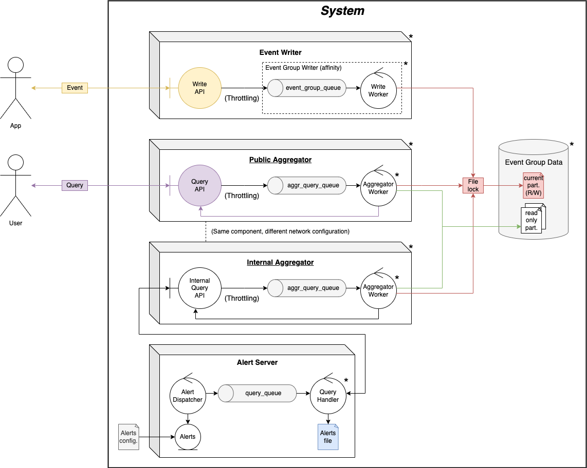

# TP1: Metrics and Alert Server

Desarrollo de un sistema distribuido que brinda servicios para el reporte de eventos de aplicación, consulta de métricas y disparo de alertas. Este sistema estará pensado para ser instalado dentro de una empresa que posee un gran ecosistema de aplicaciones y usuarios que monitorean los servicios.

**Temas:** Concurrencia y Comunicaciones.

