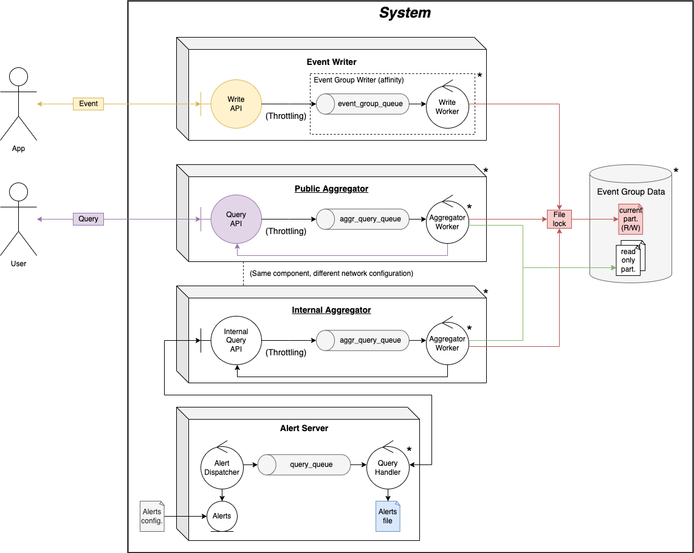

# TP1: Metrics and Alert Server

Development of a distributed system that provides services for application event reporting, metrics query and alert triggering. This system will be designed to be installed within a company that has a large ecosystem of applications and users that monitor the services.

- **Topics:** Concurrency and Communications
- [Statement](./docs/Enunciado.pdf)
- [Report](./docs/Informe.pdf)

## Usage

A `Makefile` is provided to facilitate the setup of the system, with its main commands:

- `make build` to build Docker images.
- `make up` to start the system.
- `make down` to destroy it.
- `make logs` to attach to the logs of all containers.
- `make manual-app` **(with the server running)** to connect to a simulated app that receives events via standard input.
- `make manual-client` **(with the server running)** to connect to a simulated client that receives queries via standard input.

## Architecture (Robustness Diagram)

